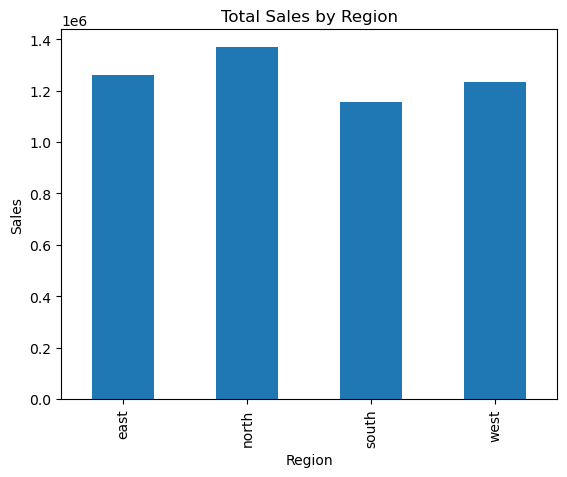

#  Task-1: Basic Data Exploration & Visualization

## Overview

This task focuses on performing basic data exploration to understand the structure, patterns, and quality of the dataset.

---

## Objective

To explore the dataset, identify key characteristics, and perform initial analysis using Python.

---

## Data Understanding

* Loaded the dataset using Pandas
* Checked data types and structure
* Identified missing values
* Understood key columns and features

---

## Exploratory Analysis

* Summary statistics of numerical columns
* Distribution of key variables
* Basic visualizations (bar charts, line plots)

---

## Sample Visualization


 Example visualization showing data distribution

---

##  Key Observations

* Dataset contains sales-related information
* Multiple regions and product categories are present
* Sales values vary across categories and regions

---

##  Tools Used

* Python (Pandas, Matplotlib)

---

## Folder Structure

notebooks/
outputs/
README.md
```

---

##  Outcome

This task builds a strong foundation for further analysis by understanding the dataset and identifying initial patterns.
