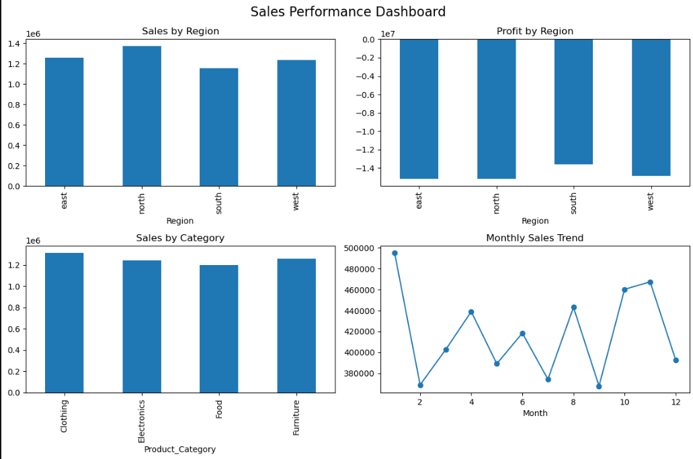

#  Task-2: Data Cleaning, SQL Analysis & EDA

##  Overview

In this task, raw sales data was cleaned and transformed into a structured dataset. Python and SQL were used to extract meaningful business insights.

---

##  Objective

To clean the dataset, perform exploratory data analysis, and answer business-related questions using SQL.

---

##  Data Cleaning

* Handled missing values
* Converted data types
* Removed inconsistencies
* Prepared a clean dataset for analysis

---

##  Analysis Performed

* Sales by Region
* Sales by Product Category
* Sales Channel Performance
* Monthly Sales Trends

---

##  SQL Analysis

Business queries were written to extract insights such as:

* Total sales by region
* Sales by category
* Channel-wise performance

---

##  Sample Output


Example visualization of sales performance

---

##  Key Insights

* North region generated the highest sales
* Retail channel performed slightly better than online
* Clothing category showed strong sales performance

---

##  Tools Used

* Python (Pandas, Matplotlib)
* SQL

---

## Folder Structure

data/
notebooks/
sql/
outputs/
README.md
```

---

##  Outcome

This task demonstrates the ability to clean data, perform analysis, and generate insights using both Python and SQL.
