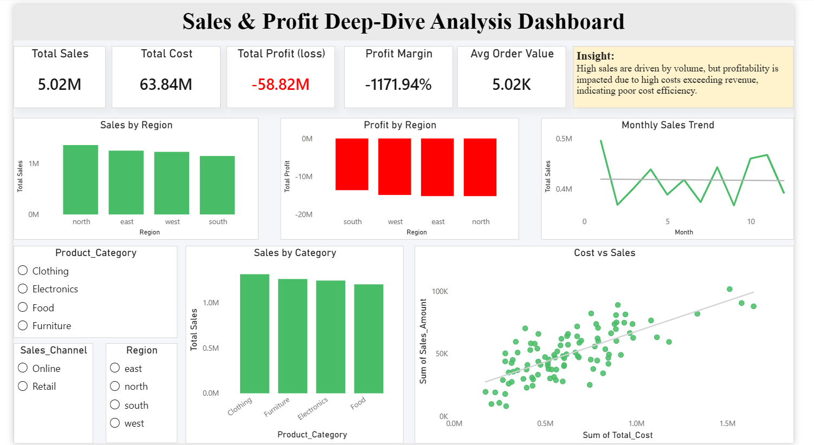

#  Task-3: Deep-Dive Analysis & Interactive Dashboard

## Overview

This task focuses on performing deeper analysis and building an interactive dashboard to understand business performance.

---

## Objective

To analyze key business metrics and build a dashboard that provides actionable insights.

---

## Dashboard Features

* Total Sales, Cost, Profit, and Profit Margin
* Sales by Region
* Profit by Region
* Sales by Category
* Monthly Sales Trend
* Cost vs Sales Analysis

---

## Dashboard Preview


 Interactive dashboard showing overall business performance

---

##  Key Insights

* Sales are high across all regions
* Profit is negative in all regions
* High sales do not guarantee profitability
* Costs are significantly higher than revenue

---

##  Analysis Performed

* Regional performance analysis
* Category-wise sales analysis
* Cost vs Sales relationship
* Trend analysis over time

---

##  Tools Used

* Python (Pandas, Matplotlib)
* Power BI

---

##  Folder Structure

data/
notebooks/
outputs/
presentation/
README.md
```

---

##  Outcome

This task demonstrates the ability to build dashboards and perform deep-dive analysis to identify critical business problems.
