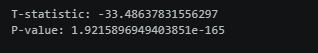

#  Task-4: Data Storytelling & Statistical Validation

##  Overview

This task transforms data analysis into a structured business story and validates insights using statistical methods.

---

##  Problem Statement

The business is generating high sales but still experiencing significant losses.

---

##  Objective

To identify the root cause of losses and validate it using statistical analysis.

---

##  Data Story

### 🔹 Observations

* Sales are high across all regions
* Profit is negative in all regions
* Costs increase with sales

### 🔹 Key Insight

High operational costs exceed revenue, leading to continuous losses.

---

##  Analysis Performed

* Profit Margin Analysis
* Cost vs Sales Analysis
* Dashboard-based insights

---

##  Key Visuals

### Cost vs Sales


 Shows that costs frequently exceed revenue, leading to losses

### Hypothesis Test Result


Statistical evidence confirming cost is higher than sales

---

##  Statistical Validation

A paired t-test was performed to compare Sales and Cost.

### Results

* T-statistic: -33.48
* P-value: ~0

### Interpretation

The p-value is less than 0.05, indicating a statistically significant difference between sales and cost.
The negative t-statistic shows that costs are higher than sales.

---

##  Conclusion

High operational costs are the primary reason for business losses.

---

##  Recommendations

* Reduce operational costs
* Improve pricing strategy
* Focus on profitability

---

##  Tools Used

* Python (Pandas, Matplotlib, SciPy)
* Power BI

---

##  Folder Structure

data/
notebooks/
outputs/
presentation/
README.md
```

---

##  Outcome

This task demonstrates how data storytelling combined with statistical validation can provide strong, data-driven business conclusions.
